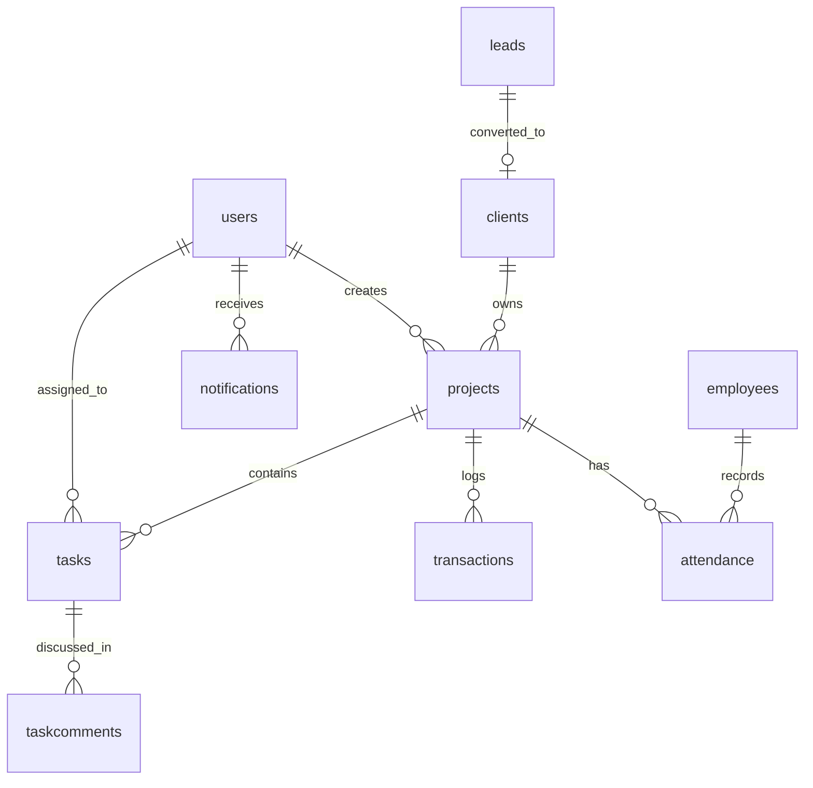

# Nirman Tracker Database Schema

This document provides a comprehensive overview of the database schema for the Nirman Tracker application. The database is powered by **MySQL**.

## Table Summary

| Table Name | Description | Related Model |
| :--- | :--- | :--- |
| `users` | Manages user accounts, authentication, and permissions. | `User.js` |
| `projects` | Core project information including budgets and timelines. | `Project.js` |
| `clients` | Client contact details and conversion info. | `Client.js` |
| `leads` | Potential client leads and tracking status. | `Lead.js` |
| `tasks` | Project-related tasks assigned to users. | `Task.js` |
| `employees` | Workforce management including salary and status. | `Employee.js` |
| `attendance` | Daily attendance records for employees on specific projects. | `Attendance.js` |
| `transactions` | Financial records for projects (Payments, Material, etc.). | `Transaction.js` |
| `notifications` | System notifications for users. | `Notification.js` |
| `taskcomments` | Discussion threads on specific tasks. | `Comment.js` |

---

## Detailed Table Schemas

### 1. `users`
| Column | Type | Constraints | Description |
| :--- | :--- | :--- | :--- |
| `id` | INT | PK, AI | Unique user identifier |
| `first_name` | VARCHAR(255) | NOT NULL | User's first name |
| `last_name` | VARCHAR(255) | NOT NULL | User's last name |
| `email` | VARCHAR(255) | NOT NULL, UNIQUE | Email address for login |
| `username` | VARCHAR(255) | NOT NULL, UNIQUE | Unique username |
| `phone` | VARCHAR(20) | | Contact phone number |
| `password` | VARCHAR(255) | NOT NULL | Hashed password |
| `role` | ENUM | | e.g., 'Admin', 'Field', etc. |
| `status` | ENUM | | 'Active', 'Inactive', 'Deleted' |
| `profile_image` | VARCHAR(255) | | Path to profile picture |
| `permissions` | JSON | | Specific user permissions |
| `is_temp_password` | TINYINT(1) | | Flag for password reset requirement |
| `created_at` | TIMESTAMP | DEFAULT CURRENT_TIMESTAMP | Record creation time |

### 2. `projects`
| Column | Type | Constraints | Description |
| :--- | :--- | :--- | :--- |
| `id` | INT | PK, AI | Unique project identifier |
| `project_name` | VARCHAR(255) | NOT NULL | Name of tracker project |
| `client_id` | INT | FK -> `clients.id` | Associated client |
| `project_type` | ENUM | | Residential, Commercial, etc. |
| `status` | ENUM | | Planning, In Progress, On Hold, etc. |
| `start_date` | DATE | NOT NULL | Project start date |
| `expected_completion_date` | DATE | | Targeted finish date |
| `actual_completion_date` | DATE | | Realized finish date |
| `estimated_budget` | DECIMAL(15,2) | | Allocated budget |
| `actual_cost` | DECIMAL(15,2) | | Current total spend |
| `description` | TEXT | | Project overview |
| `scope_of_work` | TEXT | | Detailed job scope |
| `created_by` | INT | FK -> `users.id` | User who created project |
| `created_at` | TIMESTAMP | DEFAULT CURRENT_TIMESTAMP | Record creation time |

### 3. `clients`
| Column | Type | Constraints | Description |
| :--- | :--- | :--- | :--- |
| `id` | INT | PK, AI | Unique client identifier |
| `client_name` | VARCHAR(255) | NOT NULL | Name of the client |
| `phone` | VARCHAR(20) | NOT NULL | Contact phone |
| `email` | VARCHAR(255) | | Contact email |
| `company_name` | VARCHAR(255) | | Company or organization |
| `address` | TEXT | | Client's address |
| `lead_id` | INT | FK -> `leads.id` | Associated lead (if converted) |
| `conversion_date` | TIMESTAMP | | Date converted from lead |

### 4. `leads`
| Column | Type | Constraints | Description |
| :--- | :--- | :--- | :--- |
| `id` | INT | PK, AI | Unique lead identifier |
| `contact_name` | VARCHAR(255) | NOT NULL | Primary contact person |
| `phone` | VARCHAR(20) | NOT NULL | Contact phone |
| `email` | VARCHAR(255) | | Contact email |
| `lead_status` | VARCHAR(50) | | Status (Open, Closed, etc.) |
| `is_converted` | BOOLEAN | | True if now a client |
| `is_lost` | BOOLEAN | | True if lead abandoned |

### 5. `tasks`
| Column | Type | Constraints | Description |
| :--- | :--- | :--- | :--- |
| `id` | INT | PK, AI | Unique task identifier |
| `name` | VARCHAR(255) | NOT NULL | Task title |
| `project_id` | INT | FK -> `projects.id` | Related project |
| `assignTo` | INT | FK -> `users.id` | User assigned to task |
| `assignBy` | INT | FK -> `users.id` | User who created task |
| `status` | VARCHAR(50) | | Status (In Progress, Done, etc.) |
| `priority` | ENUM | | Low, Medium, High |
| `dueDate` | DATE | | Task deadline |

### 6. `transactions`
| Column | Type | Constraints | Description |
| :--- | :--- | :--- | :--- |
| `id` | INT | PK, AI | Unique transaction identifier |
| `project_id` | INT | FK -> `projects.id` | Related project |
| `type` | ENUM | NOT NULL | Payment In/Out, Material Purchase/Return |
| `party_name` | VARCHAR(255) | NOT NULL | Person or entity involved |
| `amount` | DECIMAL(15,2) | NOT NULL | Transaction value |
| `date` | DATE | NOT NULL | Transaction date |

### 7. `employees`
| Column | Type | Constraints | Description |
| :--- | :--- | :--- | :--- |
| `id` | INT | PK, AI | Unique employee identifier |
| `name` | VARCHAR(255) | NOT NULL | Employee's full name |
| `designation` | VARCHAR(100) | | Job title |
| `department` | VARCHAR(100) | | Team/Department |
| `salary` | DECIMAL(15,2) | | Monthly/Daily salary |
| `status` | ENUM | | Active, Inactive, On Leave, Pantry |

### 8. `attendance`
| Column | Type | Constraints | Description |
| :--- | :--- | :--- | :--- |
| `id` | INT | PK, AI | Unique record identifier |
| `employee_id` | INT | FK -> `employees.id` | Associated employee |
| `project_id` | INT | FK -> `projects.id` | Project working on |
| `attendance_date` | DATE | NOT NULL | Date of record |
| `status` | ENUM | | Present, Absent, Half Day, On Leave |

---

## Entity Relationship Diagram (Conceptual)

